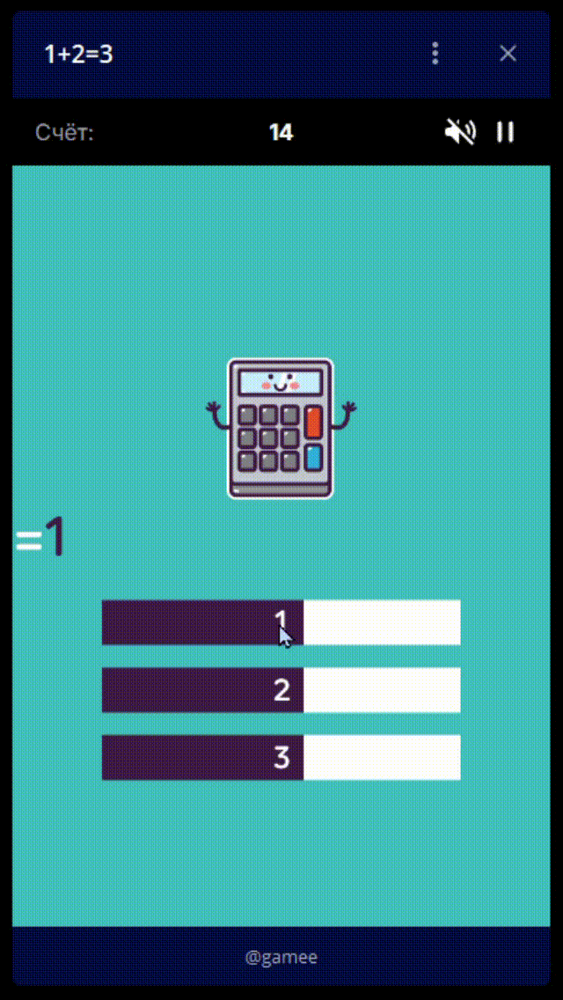

# Автоматический набор очков в игре "1+2=3" для Telegram

Этот проект предназначен для автоматического набора очков в мини-игре "1+2=3" в Telegram. Программа распознаёт математические выражения на экране, вычисляет их результат и автоматически нажимает на соответствующую кнопку (1, 2 или 3).

## Демонстрация



## Как работает программа

1. **Скриншот области экрана**: Программа делает снимок экрана в области, где отображается математическое выражение.
2. **Распознавание текста**: С помощью библиотеки EasyOCR программа распознаёт текст выражения.
3. **Очистка и вычисление**: Выражение очищается от лишних символов и вычисляется.
4. **Автоматический клик**: В зависимости от результата (1, 2 или 3) программа имитирует нажатие на соответствующую кнопку в игре.

## Требования

- **Python 3.x**
- Установленные библиотеки:
  - `pyautogui`
  - `Pillow`
  - `easyocr`
  - `numpy`

## Установка

1. Установите Python и необходимые библиотеки:
   ```bash
   pip install pyautogui pillow easyocr numpy
   ```

2. Настройте координаты области экрана и кнопок в файле `main.py`:
   - `EXPRESSION_REGION`: область экрана, где отображается выражение.
   - `DOT_COORDINATES`: координаты кнопок "1", "2" и "3".

3. Запустите скрипт:
   ```bash
   python main.py
   ```

## Настройка

- Убедитесь, что окно игры "1+2=3" в Telegram расположено так, чтобы область с выражением и кнопки совпадали с указанными координатами.
- При необходимости измените значения `EXPRESSION_REGION` и `DOT_COORDINATES` в коде.

## Предупреждение

Использование автоматизации в играх может нарушать правила платформы. Используйте этот инструмент на свой страх и риск.

